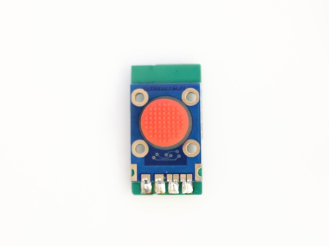
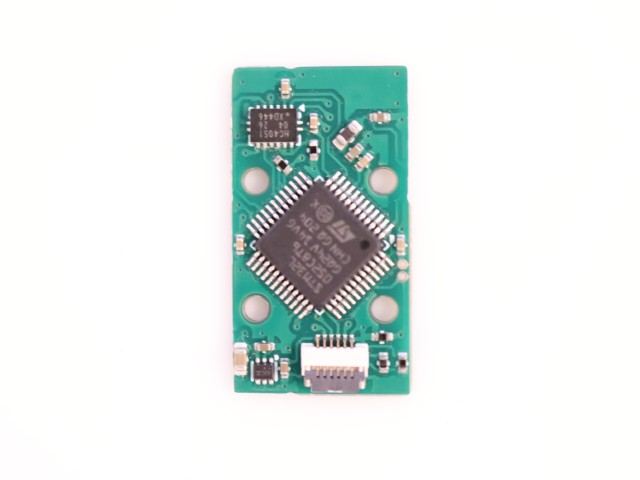
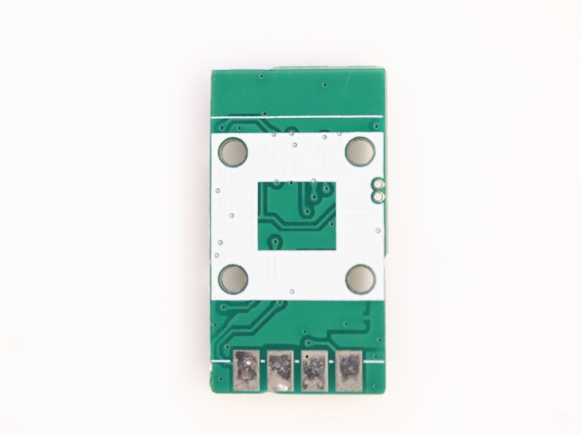
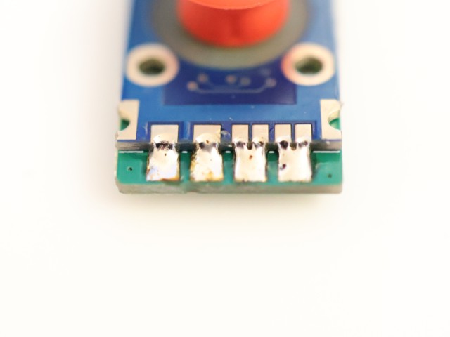
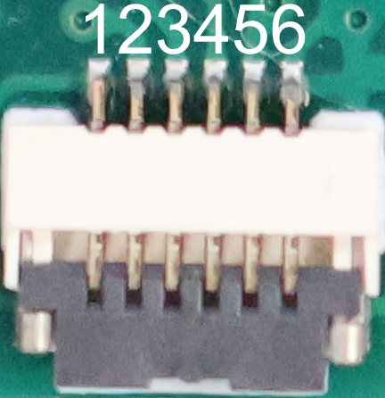
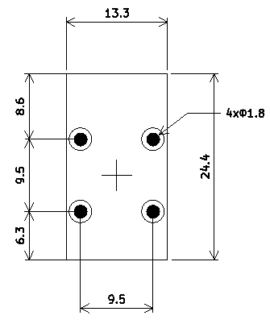

# 低消費電力ポインティングスティック

ポインティングスティックはセンサーに加えられたxyz方向の力を検出できます。LenovoのトラックポイントやHHKB Studioでのマウスカーソル操作に使用されています。

本モジュールはSK8707のセンサーをI2Cバス経由で読み取れるようにしたものです。元のSK8707付属の基板に比べるとアクティブ電流は1/6、待機電流は1/10くらいになっており、無線キーボードへの組み込みに適しています。

|||
|-|-|

## 同梱品

* 基板(センサ取り付け済み or ドライバ基板単体)

## 必要な部品

* FPC(0.5mmピッチ、6P)
* SK8707-01（ドライバ基板単体を購入した場合）
  * [Holykeebs](https://holykeebs.com/products/sk8707-01-trackpoint-sensor)
  * [Sprintek直販](https://www.sprintek.com/en/order/Order.aspx)

## 組み立て

* センサーをドライバ基板にはんだ付けしてください。ケーブルで繋ぐこともできます。

|||
|-|-|

## ピン配置

* 0.5mmピッチ6PのFPCケーブルで接続できます。

|番号|ピン|機能|
|-|-|-|
|1|VCC|2.4~3.3V|
|2|MOTION|ローのときI2C通信可能 外部からローにするとスリープモード|
|3|NC||
|4|SCL||
|5|SDA||
|6|GND||

## 機能

I2Cで3バイト(int8)を読み出すとx,y,z方向の力が読み取れます。

## ドライバ

[zmk-driver-lpps](https://github.com/sekigon-gonnoc/zmk-driver-lpps)

## 寸法

13.3 mm x 24.4 mm

